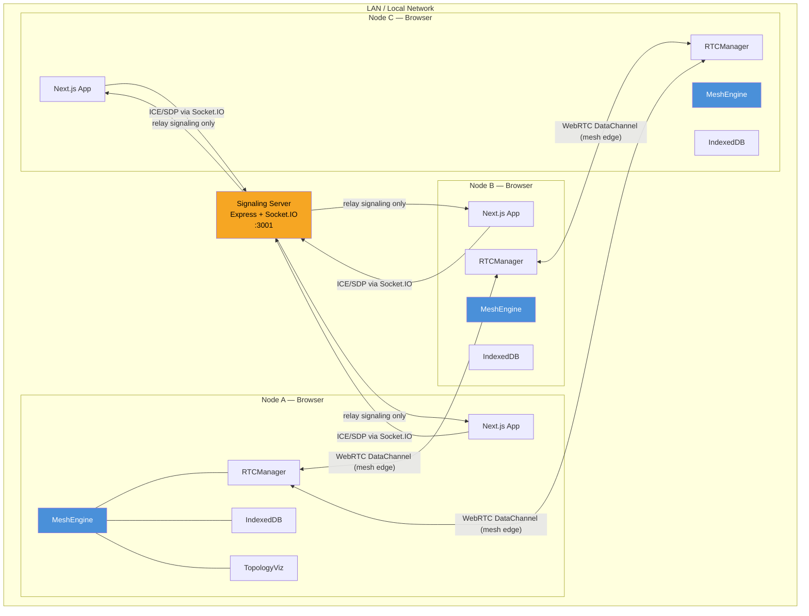
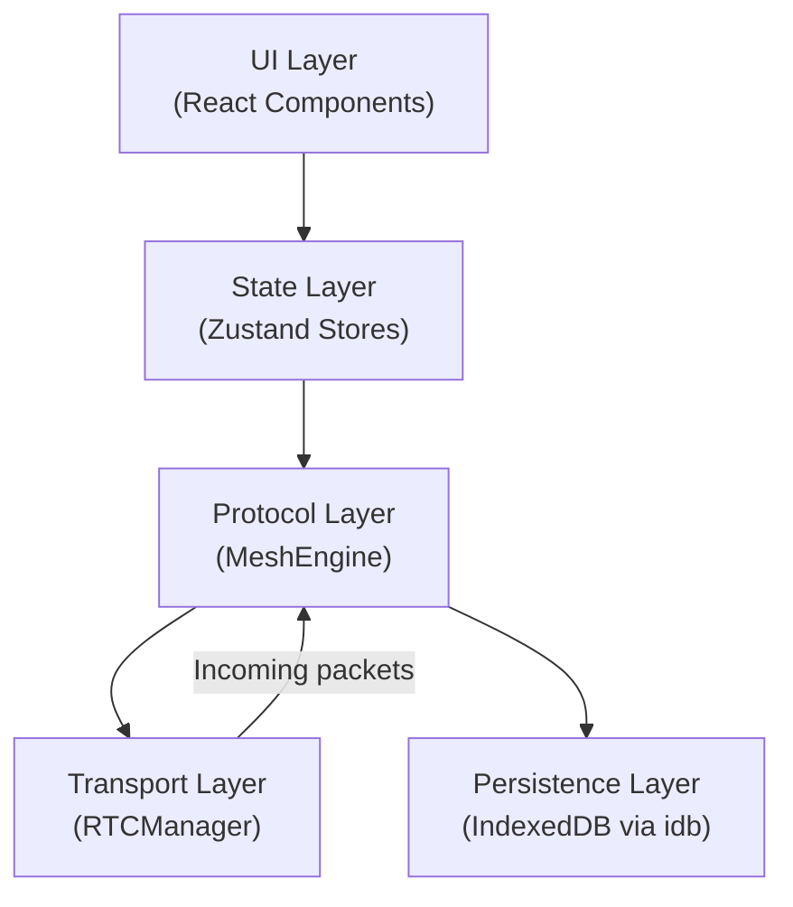
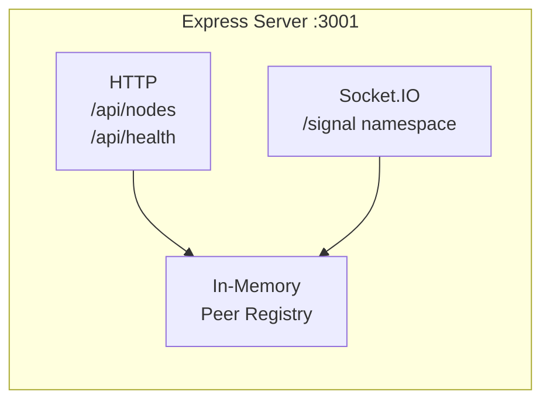
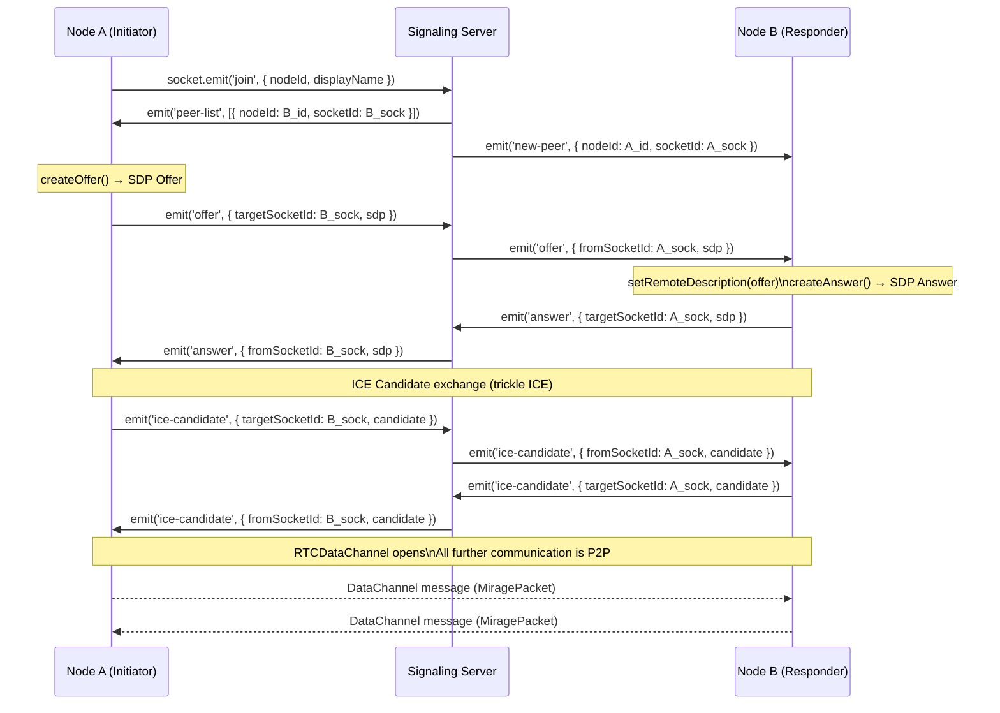
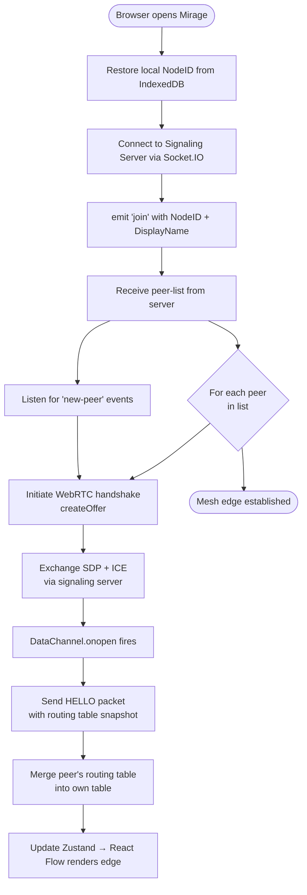
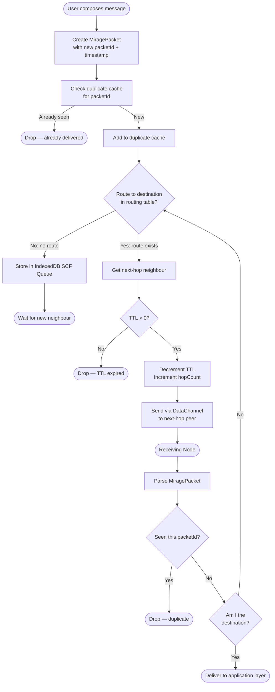
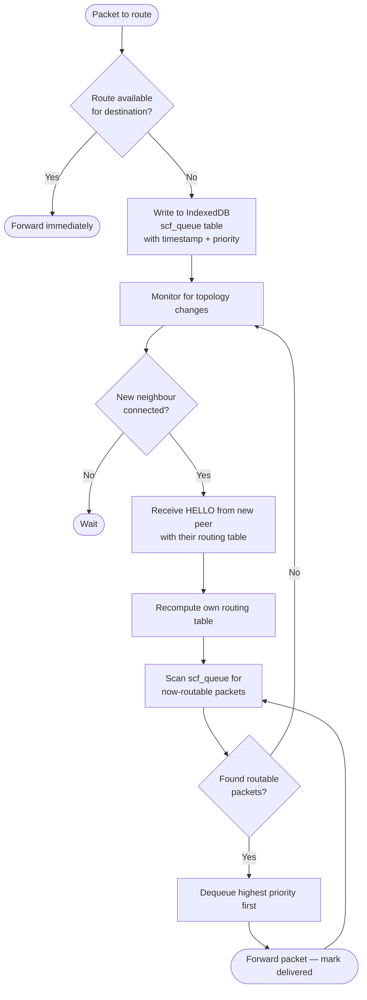
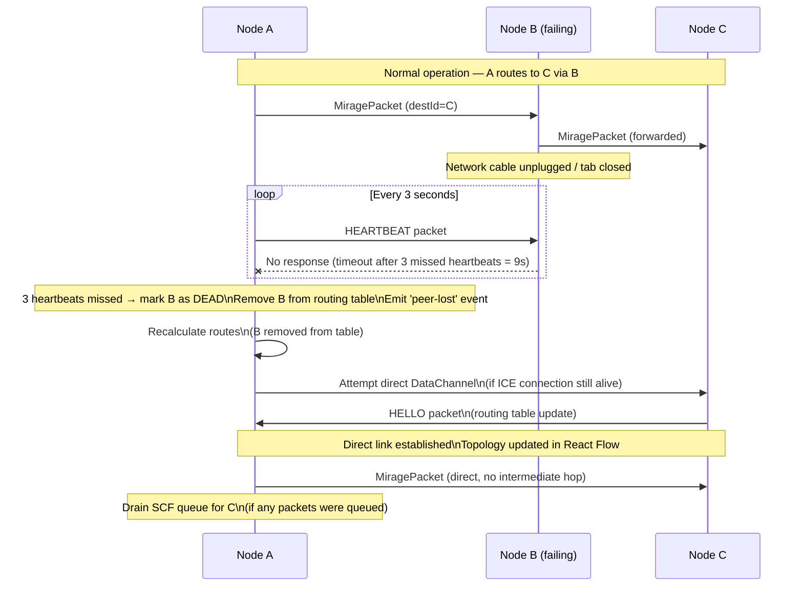

# MIRAGE — System Architecture

> Complete technical architecture for the Mirage autonomous offline mesh network.

---

## Table of Contents

1. [High-Level System Diagram](#1-high-level-system-diagram)
2. [Frontend Architecture](#2-frontend-architecture)
3. [Backend Architecture](#3-backend-architecture)
4. [WebRTC Signaling Flow](#4-webrtc-signaling-flow)
5. [Peer Discovery Flow](#5-peer-discovery-flow)
6. [Packet Lifecycle](#6-packet-lifecycle)
7. [Store-Carry-Forward Workflow](#7-store-carry-forward-workflow)
8. [Node Failure & Rerouting Workflow](#8-node-failure--rerouting-workflow)

---

## 1. High-Level System Diagram



**Key principle:** The signaling server is used only to bootstrap WebRTC connections. Once DataChannels are open, all traffic is peer-to-peer. Removing the signaling server does not break existing mesh connections.

---

## 2. Frontend Architecture

### 2.1 Layer Diagram



### 2.2 Component Tree

```
<App>
├── <TopologyPage>
│   ├── <TopologyCanvas>      — React Flow graph; nodes = peers; edges = DataChannels
│   ├── <NodeInfoPanel>       — Selected node metadata (hops, last seen, queue depth)
│   └── <PacketTraceLog>      — Live packet trace (scrollable)
├── <MessengerPanel>
│   ├── <NodeSelector>        — Pick destination peer
│   ├── <MessageComposer>     — Text input + priority selector
│   └── <MessageThread>       — Delivered messages per peer
├── <NetworkStatusBar>        — Connected peers count, queue depth, local node ID
└── <SettingsModal>           — Node display name, signaling server URL
```

### 2.3 Zustand Store Slices

| Store | Responsibility |
|---|---|
| `useMeshStore` | Connected peers, routing table, own node identity |
| `usePacketStore` | Packet queue, delivered packets, packet trace log |
| `useTopologyStore` | React Flow nodes/edges derived from peer list |
| `useUIStore` | Selected node, panel states, modal visibility |

### 2.4 MeshEngine (Core)

The `MeshEngine` is a singleton class (not a React component). It is instantiated once on page load and persists for the lifetime of the browser session.

Responsibilities:
- Orchestrate RTCManager to connect/disconnect peers
- Receive raw DataChannel messages and parse them as MiragePackets
- Implement routing logic (next-hop lookup)
- Push packets to IndexedDB queue when route is unavailable
- Emit events to Zustand stores for UI updates
- Send periodic heartbeat packets

---

## 3. Backend Architecture

The backend is intentionally minimal. It serves two purposes:
1. **Signaling relay** — forward ICE candidates and SDP offers/answers between peers
2. **Peer registry** — maintain a list of currently-online socket IDs so new nodes know who to connect to



### 3.1 Server Modules

| Module | File | Purpose |
|---|---|---|
| `app.ts` | `apps/server/src/app.ts` | Express app, CORS, health route |
| `signaling.ts` | `apps/server/src/signaling.ts` | Socket.IO handlers: join, offer, answer, ice-candidate, leave |
| `registry.ts` | `apps/server/src/registry.ts` | In-memory `Map<socketId, NodeInfo>` |

### 3.2 State

The server is **stateless with respect to packets**. It never sees application data. It only relays WebRTC handshake messages. All packet routing occurs in browser.

---

## 4. WebRTC Signaling Flow



---

## 5. Peer Discovery Flow



---

## 6. Packet Lifecycle



---

## 7. Store-Carry-Forward Workflow



---

## 8. Node Failure & Rerouting Workflow



### Failure Detection Parameters

| Parameter | Value | Rationale |
|---|---|---|
| Heartbeat interval | 3 seconds | Low overhead; fast enough for demo |
| Dead threshold | 3 missed heartbeats | 9 seconds to detect failure |
| Route recomputation | Immediate on dead detection | Distance Vector; local only |
| SCF drain delay | 1 second after route available | Allow topology to stabilise |

---

*Document version: 1.0 — Mirage Hackathon Blueprint*
