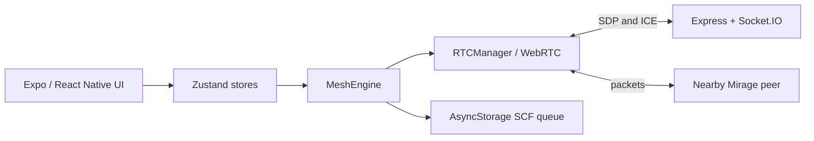

# MIRAGE — Current Architecture

## Connection lifecycle

1. `useMeshEngine` restores the local identity and initializes engine handlers.
2. The Socket.IO client connects to `EXPO_PUBLIC_SIGNALING_URL`.
3. Its `onConnect` handler joins the server. This runs on initial connect and
   every Socket.IO reconnection.
4. The server returns a peer list and broadcasts the new peer to existing
   members. Existing members initiate the WebRTC offer.
5. An opened DataChannel causes both peers to exchange a one-way HELLO snapshot,
   add direct routes, start heartbeats, and advertise route changes.

## Packet behavior

- Originated and received packets enter the duplicate cache once.
- A direct destination is sent unchanged; an intermediate router creates a
  forwarded copy that decrements TTL and appends its node ID to `hopTrace`.
- Emergency packets are broadcast to every open direct DataChannel except the
  connection that delivered the current copy.
- Unroutable DATA packets enter the priority SCF queue. The queue is stored in
  AsyncStorage and restores on app start. Entries expire by priority.
- Heartbeats run every three seconds. Three missed acknowledgements remove the
  direct peer and routes using that next hop.

## Current platform support

The repository has one Expo / React Native frontend, not a Next.js frontend.
WebRTC works in supported desktop browsers through Expo Web. A native Android or
iOS build needs a native WebRTC module and custom development build before the
same engine can run on a phone.
