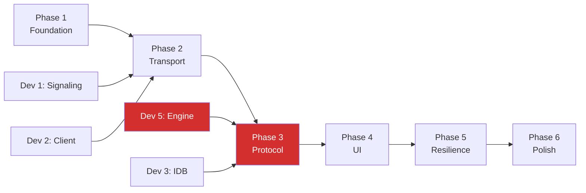

# MIRAGE — Implementation Plan

> 6-phase execution plan for a 5-member team over 36 hours.
> Each phase has a clear goal, deliverables, dependencies, estimated hours, and test checklist.

---

## Timeline Overview

```mermaid
gantt
    title MIRAGE 36-Hour Implementation Timeline
    dateFormat HH:mm
    axisFormat %H:%M

    section Phase 1 — Foundation
    Shared types + Server scaffold + IDB setup :p1, 00:00, 6h

    section Phase 2 — Transport
    WebRTC + Signaling client + Basic engine :p2, after p1, 6h

    section Phase 3 — Routing
    Packet routing + SCF queue + Heartbeat :p3, after p2, 8h

    section Phase 4 — UI
    Topology visualisation + Messenger panel :p4, after p3, 6h

    section Phase 5 — Resilience
    Failure detection + Rerouting + Emergency :p5, after p4, 6h

    section Phase 6 — Polish
    Demo prep + Bug fixes + Docs :p6, after p5, 4h
```

---

## Phase 1 — Foundation

**Hours 0–6**

### Goal
Establish the monorepo, define all shared types, scaffold the server and database layers, and ensure every developer has a running development environment.

### Deliverables

| # | Deliverable | Owner |
|---|---|---|
| 1.1 | Turborepo monorepo initialised with `apps/web`, `apps/server`, `packages/shared` | Dev 1 |
| 1.2 | `packages/shared` fully populated with all TypeScript interfaces from DATA_MODELS.md | Dev 1 |
| 1.3 | `apps/server` running on port 3001 with `GET /api/health` returning 200 | Dev 1 |
| 1.4 | Socket.IO namespace with `join` and `leave` handlers; in-memory registry | Dev 1 |
| 1.5 | IndexedDB schema initialised; `node_identity` store creates/restores local NodeId | Dev 3 |
| 1.6 | Zustand stores created with correct initial shapes (no logic yet) | Dev 3 |
| 1.7 | Next.js app booting; Tailwind configured; global layout renders | Dev 4 |
| 1.8 | Node ID generated and persisted in IndexedDB on first load | Dev 2 |

### Dependencies

- None. Phase 1 can be started immediately.
- Dev 2, Dev 4, Dev 5 must wait for `packages/shared` to be published (ETA: Hour 2).

### Estimated Hours

| Developer | Task | Hours |
|---|---|---|
| Dev 1 | Server + shared types | 6 |
| Dev 2 | Node ID utility; wait for shared types | 3 (remaining 3: review docs) |
| Dev 3 | IDB schema + Zustand skeletons | 5 |
| Dev 4 | Next.js scaffold + Tailwind | 4 |
| Dev 5 | Read all docs; design MeshEngine interface | 4 (no code yet) |

### Testing Checklist

- [ ] `GET http://localhost:3001/api/health` returns `{ status: "ok", connectedPeers: 0 }`
- [ ] Opening the web app in two browser tabs both show the same local NodeId
- [ ] IndexedDB `mirage-db` is visible in Chrome DevTools Application tab
- [ ] `packages/shared` types import successfully in both `apps/web` and `apps/server`
- [ ] Zustand DevTools extension shows empty stores with correct shape
- [ ] `progress.d` updated with Phase 1 completion entries

---

## Phase 2 — Transport Layer

**Hours 6–12**

### Goal
Two browser tabs can discover each other via the signaling server, complete WebRTC handshake, and exchange raw DataChannel messages.

### Deliverables

| # | Deliverable | Owner |
|---|---|---|
| 2.1 | Full WebRTC signaling: offer, answer, ice-candidate events on server | Dev 1 |
| 2.2 | `GET /api/nodes` returns connected node list | Dev 1 |
| 2.3 | Socket.IO client connects to server and emits `join` on page load | Dev 2 |
| 2.4 | Client receives `peer-list` and `new-peer` events | Dev 2 |
| 2.5 | `RTCManager` creates RTCPeerConnection per peer; DataChannel opens | Dev 5 |
| 2.6 | Raw string messages can be sent and received over DataChannel | Dev 5 |
| 2.7 | `useMeshStore` updates when neighbours connect/disconnect | Dev 3 |
| 2.8 | `NetworkStatusBar` shows connected peer count (live) | Dev 4 |

### Dependencies

- Phase 1 complete.
- Dev 5 depends on Dev 2's `signaling.ts` client interface.
- Dev 3 depends on Dev 5 emitting events for store updates.

### Estimated Hours

| Developer | Task | Hours |
|---|---|---|
| Dev 1 | Full signaling event handlers | 4 |
| Dev 2 | Socket.IO client + peer discovery | 5 |
| Dev 3 | Store integration with engine events | 4 |
| Dev 4 | NetworkStatusBar component | 3 |
| Dev 5 | RTCManager (peer connection + DataChannel) | 6 |

### Testing Checklist

- [ ] Open 3 browser tabs. All three show peer count = 2 in status bar.
- [ ] Close one tab. Remaining two show peer count = 1 within 5 seconds.
- [ ] In browser console: manually send a string over DataChannel; confirm receipt in second tab.
- [ ] Server console logs `join` and `disconnect` events with nodeIds.
- [ ] `GET /api/nodes` returns all 3 connected nodes.
- [ ] `progress.d` updated.

---

## Phase 3 — Protocol & Routing

**Hours 12–20**

### Goal
The Mirage protocol is fully operational. Packets are routed across multiple hops. The SCF queue stores and forwards packets. Heartbeats detect dead nodes.

### Deliverables

| # | Deliverable | Owner |
|---|---|---|
| 3.1 | `PacketBuilder` creates well-formed `MiragePacket` objects | Dev 5 |
| 3.2 | `DuplicateCache` prevents packets from being forwarded twice | Dev 5 |
| 3.3 | `MeshEngine` parses received DataChannel messages as MiragePackets | Dev 5 |
| 3.4 | `PacketRouter` performs next-hop lookup and forwards packets | Dev 5 |
| 3.5 | HELLO packet exchange on DataChannel open; routing tables merged | Dev 5 |
| 3.6 | ROUTE_UPDATE propagates routing table changes to neighbours | Dev 5 |
| 3.7 | `HeartbeatManager` sends/receives HEARTBEAT and HEARTBEAT_ACK | Dev 5 |
| 3.8 | Dead-neighbour detection triggers route recomputation | Dev 5 |
| 3.9 | `SCFQueue` enqueues packets with no route; drains on route available | Dev 5 |
| 3.10 | `scfQueueRepository` persists queue to IndexedDB | Dev 3 |
| 3.11 | `usePacketStore` updated with queued/delivered packet state | Dev 3 |
| 3.12 | `PacketTraceLog` component renders hop trace for each packet | Dev 4 |

### Dependencies

- Phase 2 complete.
- Dev 5's engine is the critical path for this entire phase.
- Dev 3 (`scfQueueRepository`) needed by Dev 5's `SCFQueue`.

### Estimated Hours

| Developer | Task | Hours |
|---|---|---|
| Dev 1 | Bug fixes from Phase 2; server-side peer registry improvements | 3 |
| Dev 2 | Signaling reconnection logic; assist Dev 5 integration | 4 |
| Dev 3 | SCF queue IDB repository; usePacketStore | 6 |
| Dev 4 | PacketTraceLog; QueueDepthBadge | 5 |
| Dev 5 | Full protocol engine (Deliverables 3.1–3.9) | 8 |

### Testing Checklist

- [ ] 3-hop routing: Laptop A sends DATA packet to C (A→B→C). Packet delivered. Hop trace shows [A, B, C].
- [ ] Duplicate suppression: Flood a packet twice; confirm B only forwards once.
- [ ] TTL expiry: Send a packet with TTL=1 to a 2-hop destination; packet is dropped.
- [ ] SCF queue: Disconnect C; send from A to C; packet appears in IndexedDB queue. Reconnect C; packet delivered.
- [ ] Heartbeat: Disconnect B; after 9 seconds, A's routing table no longer contains B.
- [ ] HELLO exchange: Connect new node D; confirm D's routing table includes A, B, C within 5 seconds.
- [ ] `progress.d` updated.

---

## Phase 4 — User Interface

**Hours 20–26**

### Goal
The full UI is working: topology visualisation shows the mesh graph live, the messenger panel demonstrates the protocol, and emergency broadcasts work.

### Deliverables

| # | Deliverable | Owner |
|---|---|---|
| 4.1 | `TopologyCanvas` renders React Flow graph with MeshNode and MeshEdge custom components | Dev 4 |
| 4.2 | `useTopologyNodes` and `useTopologyEdges` hooks derive correct React Flow data | Dev 3 |
| 4.3 | MeshNode: shows nodeId, displayName, status indicator (colour-coded), queue depth | Dev 4 |
| 4.4 | MeshEdge: shows latency, animates when a packet is forwarded | Dev 4 |
| 4.5 | `NodeInfoPanel` shows full node details on node click | Dev 4 |
| 4.6 | `NodeSelector` lists all known peers for message targeting | Dev 4 |
| 4.7 | `MessageComposer` sends DATA packets via MeshEngine | Dev 4 |
| 4.8 | `MessageThread` shows sent/received messages with delivery status | Dev 4 |
| 4.9 | `EmergencyBanner` appears when EMERGENCY packet received | Dev 4 |
| 4.10 | `EmergencyButton` sends EMERGENCY broadcast (destId = "*") | Dev 4 |
| 4.11 | `SettingsModal` allows changing display name and signaling server URL | Dev 4 |

### Dependencies

- Phase 3 complete (engine must be working).
- Dev 3's `useTopologyNodes` and `useTopologyEdges` hooks needed by Dev 4.

### Estimated Hours

| Developer | Task | Hours |
|---|---|---|
| Dev 1 | Testing infrastructure; server performance check | 2 |
| Dev 2 | Signaling edge cases; connection quality metrics | 3 |
| Dev 3 | Topology hooks; useEmergency hook | 5 |
| Dev 4 | All UI deliverables (4.1–4.11) | 6 |
| Dev 5 | Integration testing with UI; fix engine bugs surfaced by UI | 4 |

### Testing Checklist

- [ ] Open 3 tabs: all three appear as nodes in React Flow graph within 30 seconds.
- [ ] Close a tab: node disappears from graph within 10 seconds.
- [ ] Send a message from Tab A to Tab C: message appears in Tab C's MessageThread with hop trace.
- [ ] Node click: NodeInfoPanel shows correct queue depth and latency.
- [ ] Emergency button: EmergencyBanner appears on all connected nodes within 3 seconds.
- [ ] Settings: change display name; new name appears on all topology views within 5 seconds (after reconnect).
- [ ] `progress.d` updated.

---

## Phase 5 — Resilience & Edge Cases

**Hours 26–32**

### Goal
The system handles failures gracefully. Route rerouting works. SCF queue drains correctly. The demo scenario from MVP definition works end-to-end without manual intervention.

### Deliverables

| # | Deliverable | Owner |
|---|---|---|
| 5.1 | Rerouting on node failure works visually in React Flow | Dev 4 + Dev 5 |
| 5.2 | SCF queue drain on reconnection fully demonstrated | Dev 5 |
| 5.3 | Topology auto-layout reflows when nodes appear/disappear | Dev 4 |
| 5.4 | LEAVE packet sent on tab close (`beforeunload` listener) | Dev 2 |
| 5.5 | Dead node shown in grey in topology graph | Dev 4 |
| 5.6 | Packet trace log shows 'queued' status for SCF packets | Dev 4 |
| 5.7 | Server-side rate limiting on Socket.IO events (basic) | Dev 1 |
| 5.8 | All IndexedDB repositories handle errors gracefully | Dev 3 |
| 5.9 | MeshEngine gracefully degrades if signaling server disconnects | Dev 2 + Dev 5 |
| 5.10 | Full MVP demo scenario run through without errors | All |

### Dependencies

- Phase 4 complete.
- All modules must be integrated.

### Estimated Hours

| Developer | Task | Hours |
|---|---|---|
| Dev 1 | Server hardening; rate limiting; testing | 4 |
| Dev 2 | LEAVE packet; signaling degradation | 4 |
| Dev 3 | IDB error handling; stress testing | 4 |
| Dev 4 | Rerouting visuals; dead-node display | 4 |
| Dev 5 | SCF drain; engine edge cases | 4 |

### Testing Checklist

- [ ] **Full MVP scenario**: A→B→C routing → disconnect B → A and C reconnect directly → SCF queue drains. All steps work without manual intervention.
- [ ] Disconnect signaling server: existing DataChannels remain open; no crash.
- [ ] Reconnect signaling server: client reconnects and re-registers without page refresh.
- [ ] Send 50 packets rapidly: no duplicates delivered; queue empties correctly.
- [ ] Refresh page mid-session: NodeId restored from IndexedDB; reconnects within 10 seconds.
- [ ] `progress.d` updated.

---

## Phase 6 — Demo Polish & Documentation

**Hours 32–36**

### Goal
The project is demo-ready. The UI is polished. The demo script has been rehearsed. Known issues are documented.

### Deliverables

| # | Deliverable | Owner |
|---|---|---|
| 6.1 | UI visual polish: consistent spacing, colours, typography | Dev 4 |
| 6.2 | Animated packet flow on edges during routing | Dev 4 |
| 6.3 | README.md with setup instructions for judges | Dev 1 |
| 6.4 | Demo rehearsal: full 4-minute script run at least twice | All |
| 6.5 | Known issues list in `progress.d` | All |
| 6.6 | Server startup script displays LAN IP prominently | Dev 1 |
| 6.7 | Environment variable: `NEXT_PUBLIC_SIGNALING_URL` for easy config | Dev 2 |

### Dependencies

- Phase 5 complete.

### Estimated Hours

| Developer | Hours |
|---|---|
| Dev 1 | 2 |
| Dev 2 | 1 |
| Dev 3 | 1 |
| Dev 4 | 3 |
| Dev 5 | 2 |
| **Total** | **9 (buffer = 27h used, 9h remaining)** |

### Testing Checklist

- [ ] Demo rehearsed twice with three physical devices.
- [ ] All three devices show correct topology on open.
- [ ] Demo scenario (A→B→C, disconnect B, reroute) works reliably.
- [ ] README setup instructions tested on a clean machine.
- [ ] `progress.d` marked complete.

---

## Critical Path

**Phase 3 (Protocol & Routing) is the critical path. Dev 5 is the critical resource. Any delays here cascade to the entire demo.**

---

*Document version: 1.0 — Mirage Hackathon Blueprint*
