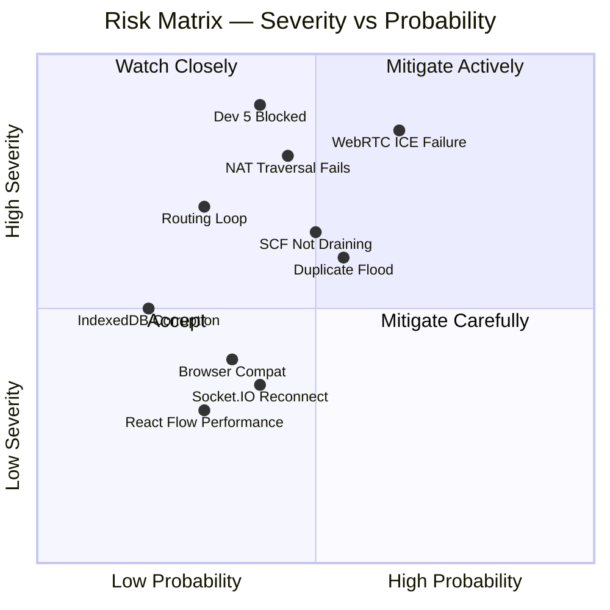

# MIRAGE — Risk Register

> Technical risk assessment for the Mirage hackathon project.
> Risks are categorised by component and rated by Severity and Probability.

---

## Risk Matrix

---

## Risk Register

### R-01 — WebRTC ICE Negotiation Failure

| Field | Value |
|---|---|
| **Category** | Transport |
| **Severity** | Critical |
| **Probability** | High |
| **Phase** | Phase 2 |
| **Owner** | Dev 2, Dev 5 |

**Description:**
WebRTC ICE negotiation can fail when both peers are behind symmetric NATs or when STUN server is unreachable. In a LAN demo environment, all devices are typically on the same local network, which makes STUN unnecessary — but misconfigurations can still cause failure.

**Mitigation:**
1. All devices must be on the same WiFi network during demo. Verify this before demo starts.
2. Configure RTCPeerConnection with `iceTransportPolicy: 'all'` to attempt all candidate types.
3. Add `stun:stun.l.google.com:19302` as a STUN server for hybrid scenarios.
4. If ICE fails, log detailed error in browser console with candidate pair state.
5. **Fallback:** If ICE consistently fails in demo environment, add a WebSocket-based DataChannel simulation that mimics the DataChannel API — this allows the demo to proceed.

**Acceptance Criteria:** Two tabs on the same WiFi connect via DataChannel within 10 seconds in 95% of attempts.

---

### R-02 — NAT Traversal Failure (Across WiFi Segments)

| Field | Value |
|---|---|
| **Category** | Transport |
| **Severity** | High |
| **Probability** | Medium |
| **Phase** | Phase 2, Demo |
| **Owner** | Dev 1, Dev 2 |

**Description:**
If the demo venue has multiple WiFi segments, APs with client isolation enabled, or enterprise WiFi blocking peer-to-peer traffic, WebRTC may fail even on the same LAN.

**Mitigation:**
1. Pre-test demo environment at venue if possible.
2. Bring a dedicated WiFi router (travel router) and use a known-good network during demo.
3. Alternatively, use a hotspot from one laptop and connect all devices to it.
4. Enable TURN server as last resort: a simple `coturn` instance can be run locally.
5. Document this risk in demo preparation checklist.

---

### R-03 — Routing Loop

| Field | Value |
|---|---|
| **Category** | Protocol |
| **Severity** | High |
| **Probability** | Low |
| **Phase** | Phase 3 |
| **Owner** | Dev 5 |

**Description:**
In a Distance Vector protocol without split-horizon, a routing loop can form when two nodes advertise each other as the best route to a third node. Each forwarding increments hopCount and decrements TTL, but if the loop forms before TTL expires, packets circulate.

**Mitigation:**
1. TTL=7 limits loop lifetime to 7 hops; packet is always dropped eventually.
2. MAX_HOP_COUNT check (drop if hopCount ≥ 15) provides a hard ceiling.
3. DuplicateCache prevents any packet from being forwarded more than once per node — this **breaks loops** even if TTL hasn't expired.
4. Monitor for routing table oscillation in the packet trace log during testing.
5. If loops are observed: add poison-reverse for directly connected routes.

**Acceptance Criteria:** No packet is forwarded more than once by any single node.

---

### R-04 — Duplicate Packet Flood

| Field | Value |
|---|---|
| **Category** | Protocol |
| **Severity** | Medium |
| **Probability** | Medium |
| **Phase** | Phase 3 |
| **Owner** | Dev 5 |

**Description:**
In a broadcast scenario (EMERGENCY packets), the same packet can arrive from multiple neighbours simultaneously. Without correct duplicate detection, each arrival triggers re-forwarding, creating exponential fan-out.

**Mitigation:**
1. DuplicateCache is checked BEFORE any processing or forwarding (early exit).
2. Cache keyed on `packetId`; cache lifetime is 60 seconds.
3. EMERGENCY packets with TTL=15 are the highest risk; test broadcast explicitly with 3+ nodes.
4. Add a counter metric: log how many duplicate drops occur per minute.

**Acceptance Criteria:** An EMERGENCY broadcast reaches all 3 nodes exactly once each.

---

### R-05 — IndexedDB Persistence Failure

| Field | Value |
|---|---|
| **Category** | Persistence |
| **Severity** | Medium |
| **Probability** | Low |
| **Phase** | Phase 3 |
| **Owner** | Dev 3 |

**Description:**
IndexedDB operations are asynchronous and can fail due to: storage quota exceeded, private browsing mode (some browsers disallow IDB), version upgrade conflicts, or transaction aborts.

**Mitigation:**
1. Wrap all IDB operations in try-catch; log errors without crashing.
2. If IDB is unavailable, fall back to in-memory storage (declare a `MemoryFallback` adapter).
3. Test in Chrome, Firefox, and Safari (especially Safari's IDB quirks).
4. Avoid large transactions; split bulk writes into individual `put()` calls.
5. SCF queue in-memory fallback ensures demo continues even if IDB fails.

**Acceptance Criteria:** If IDB fails to initialise, the app loads and functions (without persistence).

---

### R-06 — Dev 5 (Engine) Becomes Blocked

| Field | Value |
|---|---|
| **Category** | Team |
| **Severity** | Critical |
| **Probability** | Medium |
| **Phase** | Phase 3 (critical path) |
| **Owner** | Team Lead |

**Description:**
The MeshEngine (Phase 3) is the critical path. If Dev 5 is blocked by a bug, technical complexity, or integration issues, the entire project timeline slips.

**Mitigation:**
1. Dev 1 (most experienced with distributed systems) is designated as immediate backup for Dev 5.
2. At Hour 14 checkpoint: if Phase 3 progress is less than 50%, Dev 1 and Dev 2 pivot to assist.
3. Simplify routing algorithm if needed: start with direct-only routing (no multi-hop) and add hops iteratively.
4. Reduce protocol complexity: remove ROUTE_UPDATE packets; rely solely on HELLO for route discovery.
5. Pre-build isolated test harness for engine (no browser needed) to accelerate debugging.

---

### R-07 — SCF Queue Not Draining on Reconnect

| Field | Value |
|---|---|
| **Category** | Protocol |
| **Severity** | High |
| **Probability** | Medium |
| **Phase** | Phase 3, Phase 5 |
| **Owner** | Dev 5, Dev 3 |

**Description:**
The SCF queue drain logic depends on: (1) correctly detecting when a new route becomes available, (2) correctly looking up queued packets by `destId`, (3) IDB read performance under load. Any failure here breaks the core demo scenario.

**Mitigation:**
1. Trigger queue scan on EVERY routing table update, not just on peer connection.
2. Use an IndexedDB index on `destId` for O(log n) lookups, not full table scan.
3. Test queue drain explicitly: enqueue 10 packets, reconnect, verify all 10 deliver.
4. Add a manual "retry queue" button in the UI as a demo fallback.
5. Set a 1-second polling fallback: if event-based drain fails, poll IDB every 1s.

**Acceptance Criteria:** Within 3 seconds of route becoming available, all pending SCF packets for that destination are forwarded.

---

### R-08 — Browser Compatibility

| Field | Value |
|---|---|
| **Category** | Environment |
| **Severity** | Low |
| **Probability** | Medium |
| **Phase** | All |
| **Owner** | Dev 2, Dev 4 |

**Description:**
WebRTC DataChannel behaviour differs across browsers. Safari has historically lagged on WebRTC support. Some conference venue machines may use corporate browsers with extensions blocking WebRTC.

**Mitigation:**
1. **Primary target:** Chrome/Chromium on all demo devices. Test exclusively on Chrome.
2. **Secondary:** Firefox (known good WebRTC support).
3. **Avoid Safari** for the demo unless extra testing is done.
4. Bring demo devices pre-configured with Chrome.
5. Test `navigator.mediaDevices` and `RTCPeerConnection` availability on startup; show a friendly error if unsupported.

**Acceptance Criteria:** Demo works reliably on Chrome 120+ on all demo devices.

---

### R-09 — React Flow Performance with Frequent Updates

| Field | Value |
|---|---|
| **Category** | Frontend |
| **Severity** | Low |
| **Probability** | Low |
| **Phase** | Phase 4 |
| **Owner** | Dev 4 |

**Description:**
React Flow re-renders the graph on every node/edge update. Heartbeats update latency every 3 seconds for each neighbour, potentially causing jank.

**Mitigation:**
1. Debounce topology store updates: collect heartbeat data for 1 second, then batch-update React Flow state.
2. Use `React.memo` on custom MeshNode and MeshEdge components.
3. Set React Flow's `nodesDraggable: true` only on user interaction, not auto-layout updates.
4. Use `useCallback` for all React Flow event handlers.

**Acceptance Criteria:** Topology view remains smooth (>30fps) with 10 connected nodes and continuous heartbeats.

---

### R-10 — Socket.IO Reconnection Race Condition

| Field | Value |
|---|---|
| **Category** | Transport |
| **Severity** | Low |
| **Probability** | Medium |
| **Phase** | Phase 2, Phase 5 |
| **Owner** | Dev 2 |

**Description:**
If the signaling server restarts mid-session, Socket.IO auto-reconnects. The client re-emits `join`, receives a new `peer-list`, and attempts to reconnect to all peers. If existing DataChannels are still open, this can create duplicate connections.

**Mitigation:**
1. Before initiating a new WebRTC connection, check if a DataChannel to that peer already exists and is `open`.
2. If existing channel is open: do not create a new one; skip signaling.
3. If existing channel is `closed` or `closing`: clean up and create new.
4. Track connection state per `nodeId` in RTCManager.

**Acceptance Criteria:** Signaling server restart does not create duplicate DataChannels.

---

## Risk Summary Table

| ID | Risk | Severity | Probability | Owner | Phase |
|---|---|---|---|---|---|
| R-01 | WebRTC ICE Negotiation Failure | Critical | High | Dev 2, Dev 5 | 2 |
| R-02 | NAT Traversal (AP Isolation) | High | Medium | Dev 1, Dev 2 | 2, Demo |
| R-03 | Routing Loop | High | Low | Dev 5 | 3 |
| R-04 | Duplicate Packet Flood | Medium | Medium | Dev 5 | 3 |
| R-05 | IndexedDB Failure | Medium | Low | Dev 3 | 3 |
| R-06 | Dev 5 Blocked (Critical Path) | Critical | Medium | Team Lead | 3 |
| R-07 | SCF Queue Not Draining | High | Medium | Dev 5, Dev 3 | 3, 5 |
| R-08 | Browser Compatibility | Low | Medium | Dev 2, Dev 4 | All |
| R-09 | React Flow Performance | Low | Low | Dev 4 | 4 |
| R-10 | Socket.IO Reconnect Race | Low | Medium | Dev 2 | 2, 5 |

---

*Document version: 1.0 — Mirage Hackathon Blueprint*
