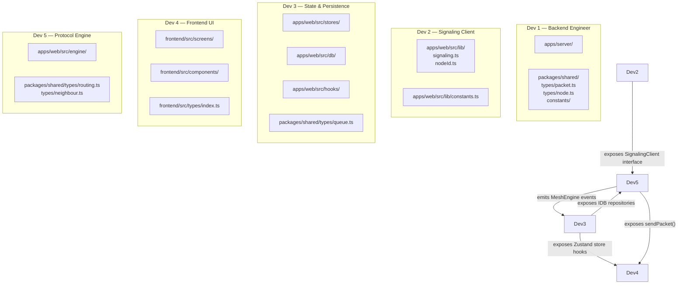

# MIRAGE — Team Assignment

> Module ownership, file responsibilities, interfaces exposed, and integration checkpoints for all 5 developers.
> No two developers own the same file. Merge conflicts are prevented by design.

---

## Ownership Overview



---

## Developer 1 — Backend Engineer

### Primary Responsibility
Own the signaling server entirely. Define and publish all shared TypeScript types.

### Files Owned

| File | Description |
|---|---|
| `apps/server/src/app.ts` | Express app |
| `apps/server/src/server.ts` | Entry point + LAN IP display |
| `apps/server/src/routes/health.ts` | GET /api/health |
| `apps/server/src/routes/nodes.ts` | GET /api/nodes, GET /api/nodes/:id |
| `apps/server/src/signaling/signaling.ts` | Socket.IO namespace setup |
| `apps/server/src/signaling/handlers/*.ts` | All 6 event handlers |
| `apps/server/src/signaling/validation.ts` | Zod schemas |
| `apps/server/src/registry/registry.ts` | In-memory peer registry |
| `apps/server/src/utils/logger.ts` | Logger |
| `apps/server/src/utils/network.ts` | LAN IP utility |
| `packages/shared/src/types/packet.ts` | MiragePacket and all payload types |
| `packages/shared/src/types/node.ts` | MirageNode, NodeSummary |
| `packages/shared/src/types/signaling.ts` | All Socket.IO payload interfaces |
| `packages/shared/src/constants/protocol.ts` | MIRAGE_CONSTANTS |
| `packages/shared/src/constants/idb.ts` | IDB_CONFIG |
| `packages/shared/src/constants/nodeId.ts` | NODE_ID_PREFIX |
| `packages/shared/src/index.ts` | Barrel export |
| `turbo.json` | Turborepo pipeline |
| `package.json` (root) | Workspace config |
| `README.md` | Setup instructions |

### Interfaces Exposed

```typescript
// Socket.IO events (from API_SPEC.md)
// Server emits: peer-list, new-peer, offer, answer, ice-candidate, peer-left, signaling-error
// Server receives: join, offer, answer, ice-candidate, leave
```

All REST endpoints described in API_SPEC.md.

### Dependencies

- None. Dev 1 can start immediately.

### Integration Checkpoints

| Hour | Checkpoint |
|---|---|
| +2 | `packages/shared` published; all other devs unblocked |
| +4 | `GET /api/health` returns 200 |
| +8 | Full signaling (offer/answer/ICE) working; Dev 2 can integrate |
| +12 | `GET /api/nodes` returning live data |
| +24 | Server stable; rate limiting added |
| +34 | README complete; `npm run start` works from fresh clone |

---

## Developer 2 — Signaling Client & Integration

### Primary Responsibility
Build the browser-side Socket.IO client that connects to the signaling server. Bridge signaling events into the MeshEngine. Handle graceful disconnection and reconnection.

### Files Owned

| File | Description |
|---|---|
| `apps/web/src/lib/signaling.ts` | Socket.IO client; emits join, offers, ICE; handles server events |
| `apps/web/src/lib/nodeId.ts` | Generates and restores NodeId from IndexedDB |
| `apps/web/src/lib/constants.ts` | Frontend constants and env var access |

### Interfaces Exposed

```typescript
// signaling.ts exports:
interface SignalingClient {
  connect(url: string): void;
  disconnect(): void;
  join(nodeId: string, displayName: string): void;
  sendOffer(targetSocketId: string, sdp: RTCSessionDescriptionInit): void;
  sendAnswer(targetSocketId: string, sdp: RTCSessionDescriptionInit): void;
  sendIceCandidate(targetSocketId: string, candidate: RTCIceCandidateInit): void;
  sendLeave(): void;

  // Event callbacks — set by RTCManager (Dev 5)
  onPeerList: (peers: NodeSummary[]) => void;
  onNewPeer: (peer: NodeSummary) => void;
  onOffer: (from: ForwardedOfferPayload) => void;
  onAnswer: (from: ForwardedAnswerPayload) => void;
  onIceCandidate: (from: ForwardedIceCandidatePayload) => void;
  onPeerLeft: (payload: PeerLeftPayload) => void;
}

// nodeId.ts exports:
function getOrCreateNodeId(): Promise<string>;
```

### Dependencies

- `packages/shared` (Dev 1) — for SignalingPayload types
- `apps/server` must be running (Dev 1)

### Integration Checkpoints

| Hour | Checkpoint |
|---|---|
| +6 | NodeId utility complete; tested in browser console |
| +10 | `join` event sent on load; `peer-list` received |
| +14 | Full signaling flow working; Dev 5 RTCManager can call SignalingClient |
| +26 | LEAVE packet sent on `beforeunload` |
| +30 | Signaling reconnection after server restart works |

---

## Developer 3 — State Management & Persistence

### Primary Responsibility
Own all Zustand stores and all IndexedDB repositories. Bridge the MeshEngine's events into React state.

### Files Owned

| File | Description |
|---|---|
| `apps/web/src/stores/useMeshStore.ts` | Peers, routing table, own node ID |
| `apps/web/src/stores/usePacketStore.ts` | Packet queue, trace log, delivered messages |
| `apps/web/src/stores/useTopologyStore.ts` | Derived React Flow node/edge state |
| `apps/web/src/stores/useUIStore.ts` | UI-only state |
| `apps/web/src/db/database.ts` | IndexedDB init and version migration |
| `apps/web/src/db/nodeIdentityRepository.ts` | CRUD for node_identity |
| `apps/web/src/db/scfQueueRepository.ts` | CRUD for scf_queue |
| `apps/web/src/db/deliveredPacketRepository.ts` | CRUD for delivered_packets |
| `apps/web/src/db/emergencyRepository.ts` | CRUD for emergency_markers |
| `apps/web/src/db/settingsRepository.ts` | CRUD for settings |
| `apps/web/src/hooks/useMeshEngine.ts` | Returns singleton MeshEngine |
| `apps/web/src/hooks/useTopologyNodes.ts` | Derives React Flow nodes |
| `apps/web/src/hooks/useTopologyEdges.ts` | Derives React Flow edges |
| `apps/web/src/hooks/usePacketTrace.ts` | Formatted packet trace for UI |
| `apps/web/src/hooks/useEmergency.ts` | Emergency state + acknowledgement |
| `packages/shared/src/types/queue.ts` | QueueEntry |
| `packages/shared/src/types/persistence.ts` | IndexedDB model types |

### Interfaces Exposed

```typescript
// Zustand stores — consumed by Dev 4 components via hooks
useMeshStore(): {
  localNode: MirageNode;
  peers: Map<string, MirageNode>;
  routingTable: RoutingTable;
  // ... actions
}

usePacketStore(): {
  scfQueue: QueueEntry[];
  traceLog: PacketTraceEntry[];
  deliveredMessages: UIMessage[];
  // ... actions
}

// IDB repositories — consumed by Dev 5 MeshEngine
scfQueueRepository: {
  enqueue(entry: Omit<QueueEntry, 'queueId'>): Promise<number>;
  dequeueByDestId(destId: string): Promise<QueueEntry[]>;
  updateStatus(queueId: number, status: QueueEntry['status']): Promise<void>;
  pruneExpired(): Promise<number>;
}
```

### Dependencies

- `packages/shared` (Dev 1) — for all type imports
- Dev 5 `MeshEngine` must emit events that stores subscribe to

### Integration Checkpoints

| Hour | Checkpoint |
|---|---|
| +6 | IndexedDB schema up; nodeIdentityRepository tested |
| +10 | Zustand stores initialised with correct shapes |
| +16 | scfQueueRepository operational; Dev 5 can call it |
| +20 | Topology hooks return correct React Flow data |
| +24 | All hooks tested with live engine events |

---

## Developer 4 — Frontend UI

> **Platform change:** React Native / Expo instead of Next.js. All functionality equivalent.

### Primary Responsibility
Build the entire React Native screen tree and component library. Wire screens to Zustand stores and hooks.

### Files Owned

| File | Description |
|---|---|
| `frontend/App.tsx` | Root entry — mounts `useMeshEngine()`, screen router |
| `frontend/src/screens/HomeScreen.tsx` | SOS screen; live peer count; real emergency broadcast |
| `frontend/src/screens/ChatScreen.tsx` | Per-peer message thread; uses `usePeerMessages` hook |
| `frontend/src/screens/MessagesListScreen.tsx` | Live peer list; last messages from store |
| `frontend/src/screens/ProfileScreen.tsx` | Node identity and settings |
| `frontend/src/components/SosButton.tsx` | Animated ripple SOS button |
| `frontend/src/components/AddressCard.tsx` | Address display card |
| `frontend/src/components/ChatBubble.tsx` | Message bubble with hop trace info |
| `frontend/src/components/MessageComposer.tsx` | Text input + priority picker + send |
| `frontend/src/components/BottomNav.tsx` | Tab bar navigation |
| `frontend/src/types/index.ts` | UI types (ChatMessage, ScreenType, Conversation) |

### Interfaces Exposed

- Screens are self-contained; no external interface.
- Dev 4 consumes:
  - `useMeshStore()` — peer list, connection status, local identity
  - `usePeerMessages(peerId)` — message thread + send action
  - `useEmergency()` — emergency state + `broadcastEmergency()`

### Dependencies

- Dev 3 stores + hooks (for data)
- Dev 5 `MeshEngine` (accessed only via hooks, never directly)

### Integration Checkpoints

| Hour | Checkpoint |
|---|---|
| +8 | Next.js pages routing correctly; layout renders |
| +14 | NetworkStatusBar shows live peer count |
| +22 | TopologyCanvas renders nodes and edges from hooks |
| +26 | Messenger panel sends and receives messages |
| +30 | Emergency UI tested |
| +34 | Full visual polish pass |

---

## Developer 5 — Protocol Engine

### Primary Responsibility
Implement the entire MeshEngine — the core of Mirage. This is the most complex module and the critical path.

### Files Owned

| File | Description |
|---|---|
| `apps/web/src/engine/MeshEngine.ts` | Top-level orchestrator |
| `apps/web/src/engine/RTCManager.ts` | WebRTC peer connections |
| `apps/web/src/engine/PacketRouter.ts` | Routing table + next-hop |
| `apps/web/src/engine/PacketBuilder.ts` | Constructs MiragePackets |
| `apps/web/src/engine/DuplicateCache.ts` | Seen-packet cache |
| `apps/web/src/engine/HeartbeatManager.ts` | Heartbeat lifecycle |
| `apps/web/src/engine/SCFQueue.ts` | SCF queue abstraction |
| `packages/shared/src/types/routing.ts` | RoutingEntry, RoutingTable |
| `packages/shared/src/types/neighbour.ts` | Neighbour |

### Interfaces Exposed

```typescript
// MeshEngine — consumed by useMeshEngine hook (Dev 3)
class MeshEngine {
  // Lifecycle
  initialize(localNodeId: string, signalingClient: SignalingClient): Promise<void>;
  destroy(): void;

  // Sending
  sendPacket(destId: string, payload: DataPayload, priority?: PacketPriority): void;
  sendEmergency(text: string, severity: EmergencyPayload['severity']): void;

  // Events — subscribe to these in Zustand stores (Dev 3)
  on(event: 'peer-connected', handler: (node: MirageNode) => void): void;
  on(event: 'peer-disconnected', handler: (nodeId: string) => void): void;
  on(event: 'packet-received', handler: (packet: MiragePacket) => void): void;
  on(event: 'packet-forwarded', handler: (packet: MiragePacket) => void): void;
  on(event: 'packet-queued', handler: (entry: QueueEntry) => void): void;
  on(event: 'packet-delivered', handler: (packet: MiragePacket) => void): void;
  on(event: 'route-updated', handler: (table: RoutingTable) => void): void;
  on(event: 'emergency', handler: (marker: EmergencyMarker) => void): void;
}
```

### Dependencies

- Dev 1: `packages/shared` types
- Dev 2: `SignalingClient` interface (for RTCManager to call)
- Dev 3: `scfQueueRepository` (for IndexedDB SCF persistence)

### Integration Checkpoints

| Hour | Checkpoint |
|---|---|
| +12 | RTCManager creates peer connections and opens DataChannels |
| +16 | MeshEngine parses MiragePackets from DataChannel messages |
| +18 | PacketRouter performs next-hop and forwards DATA packets |
| +20 | HELLO exchange works; routing tables merged |
| +22 | HeartbeatManager detects dead peers |
| +24 | SCFQueue queues and drains correctly |
| +28 | Full 3-hop routing tested |
| +30 | Rerouting after node failure works |

---

## Integration Conflict Prevention Rules

1. **No shared file ownership.** Each file has exactly one owner. PRs touching files outside ownership require approval from the owner.
2. **`packages/shared` changes require a `progress.d` entry.** Any addition to shared types must be documented before use.
3. **Engine ↔ Stores boundary is event-based.** MeshEngine emits events; Zustand stores subscribe. No direct function calls from Engine into stores.
4. **Engine ↔ DB boundary is repository-based.** MeshEngine calls IDB repositories; it does not touch IndexedDB directly.
5. **UI components never import from `engine/`.** They only use hooks from `hooks/` and stores from `stores/`.
6. **All cross-team integration happens at defined checkpoints.** Do not attempt integration outside the checkpoint schedule.

---

*Document version: 1.0 — Mirage Hackathon Blueprint*
